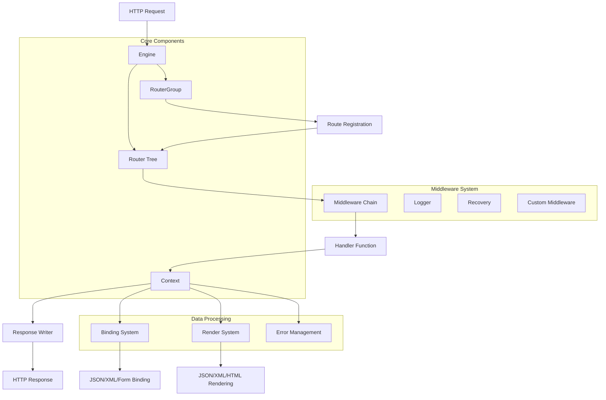

# Gin Web Framework 源代码学习计划

## 项目概述

Gin是一个用Go语言编写的高性能HTTP Web框架，提供类似Martini的API，但性能比Martini快40倍。它基于httprouter实现零内存分配的路由器，是构建REST API、Web应用和微服务的理想选择。

## 项目架构分析

### 核心架构图



### 模块功能详解

#### 1. 核心引擎模块 (Engine)
**文件**: `gin.go`
**功能**:
- 框架的核心实例，包含路由器、中间件和配置设置
- 实现http.Handler接口，可直接用于http.Server
- 管理全局配置如重定向、代理信任、HTML模板等
- 提供多种启动方式：HTTP、HTTPS、Unix Socket、文件描述符等

**核心API**:
```go
// 创建引擎实例
func New(opts ...OptionFunc) *Engine
func Default(opts ...OptionFunc) *Engine

// 启动服务器
func (engine *Engine) Run(addr ...string) error
func (engine *Engine) RunTLS(addr, certFile, keyFile string) error
func (engine *Engine) RunUnix(file string) error

// 中间件管理
func (engine *Engine) Use(middleware ...HandlerFunc) IRoutes
func (engine *Engine) NoRoute(handlers ...HandlerFunc)
func (engine *Engine) NoMethod(handlers ...HandlerFunc)
```

#### 2. 上下文模块 (Context)
**文件**: `context.go`
**功能**:
- 封装HTTP请求和响应
- 提供参数获取、数据绑定、响应渲染等功能
- 管理中间件执行流程
- 提供键值存储用于中间件间数据传递

**核心API**:
```go
// 参数获取
func (c *Context) Param(key string) string
func (c *Context) Query(key string) string
func (c *Context) PostForm(key string) string

// 数据绑定
func (c *Context) Bind(obj any) error
func (c *Context) ShouldBind(obj any) error
func (c *Context) BindJSON(obj any) error

// 响应渲染
func (c *Context) JSON(code int, obj any) 
func (c *Context) XML(code int, obj any)
func (c *Context) HTML(code int, name string, obj any)

// 流程控制
func (c *Context) Next()
func (c *Context) Abort()
func (c *Context) AbortWithStatus(code int)
```

#### 3. 路由系统 (Router & Tree)
**文件**: `routergroup.go`, `tree.go`
**功能**:
- 基于Radix Tree的高效路由匹配
- 支持路径参数和通配符
- 路由分组和中间件继承
- 静态文件服务

**核心数据结构**:
```go
type node struct {
    path      string        // 节点路径
    indices   string        // 子节点索引
    wildChild bool          // 是否有通配符子节点
    nType     nodeType      // 节点类型(static/root/param/catchAll)
    priority  uint32        // 优先级
    children  []*node       // 子节点
    handlers  HandlersChain // 处理器链
    fullPath  string        // 完整路径
}
```

#### 4. 数据绑定系统 (Binding)
**文件**: `binding/`目录
**功能**:
- 自动将请求数据绑定到Go结构体
- 支持多种数据格式：JSON、XML、Form、Query、Header等
- 集成数据验证功能

**支持的绑定类型**:
- JSON绑定 (`binding.JSON`)
- XML绑定 (`binding.XML`)
- Form绑定 (`binding.Form`)
- Query绑定 (`binding.Query`)
- Header绑定 (`binding.Header`)
- URI绑定 (`binding.Uri`)

#### 5. 渲染系统 (Render)
**文件**: `render/`目录
**功能**:
- 统一的响应渲染接口
- 支持多种输出格式
- 自动设置Content-Type头

**支持的渲染类型**:
- JSON渲染 (标准、缩进、安全、ASCII、纯净)
- XML渲染
- HTML模板渲染
- YAML/TOML渲染
- 文件下载
- 重定向

#### 6. 中间件系统
**文件**: `logger.go`, `recovery.go`
**功能**:
- 请求日志记录
- Panic恢复
- 可扩展的中间件链

**内置中间件**:
- Logger: 请求日志记录，支持自定义格式
- Recovery: Panic恢复，防止服务器崩溃
- 支持自定义中间件开发

#### 7. 错误处理系统
**文件**: `errors.go`
**功能**:
- 统一的错误类型定义
- 错误分类和过滤
- JSON序列化支持

#### 8. 响应写入器
**文件**: `response_writer.go`
**功能**:
- 包装标准http.ResponseWriter
- 提供状态码和响应大小统计
- 支持HTTP/2推送、连接劫持等高级功能

#### 9. 工具模块
**文件**: `internal/`目录
**功能**:
- 字节转换优化 (`bytesconv`)
- 文件系统抽象 (`fs`)

## 学习计划

### 第一阶段：基础理解 (1-2周)

#### 目标
- 理解Gin的基本概念和设计理念
- 掌握核心组件的作用和关系
- 能够编写简单的Gin应用

#### 学习内容
1. **项目结构分析**
   - [ ] 阅读 `README.md` 和 `doc.go`
   - [ ] 理解项目目录结构
   - [ ] 了解依赖关系 (`go.mod`)

2. **核心概念学习**
   - [ ] 学习HTTP框架的基本概念
   - [ ] 理解中间件模式
   - [ ] 了解路由匹配原理

3. **简单示例实践**
   - [ ] 运行基础示例程序
   - [ ] 实现简单的CRUD API
   - [ ] 尝试不同的响应格式

#### 实践任务
```go
// 任务1: 创建基础API服务器
func main() {
    r := gin.Default()
    
    // 基础路由
    r.GET("/", func(c *gin.Context) {
        c.JSON(200, gin.H{"message": "Hello Gin"})
    })
    
    // 路径参数
    r.GET("/user/:id", func(c *gin.Context) {
        id := c.Param("id")
        c.JSON(200, gin.H{"user_id": id})
    })
    
    // 查询参数
    r.GET("/search", func(c *gin.Context) {
        query := c.Query("q")
        c.JSON(200, gin.H{"query": query})
    })
    
    r.Run(":8080")
}
```

### 第二阶段：核心模块深入 (2-3周)

#### 目标
- 深入理解Engine和Context的实现
- 掌握路由系统的工作原理
- 理解中间件的执行机制

#### 学习内容

1. **Engine模块分析** (`gin.go`)
   - [ ] 分析Engine结构体的字段含义
   - [ ] 理解New()和Default()的区别
   - [ ] 学习各种启动方式的实现
   - [ ] 掌握配置选项的使用

2. **Context模块分析** (`context.go`)
   - [ ] 理解Context的生命周期
   - [ ] 分析参数获取方法的实现
   - [ ] 学习键值存储机制
   - [ ] 掌握流程控制方法

3. **路由系统分析** (`routergroup.go`, `tree.go`)
   - [ ] 理解Radix Tree的数据结构
   - [ ] 分析路由注册过程
   - [ ] 学习路由匹配算法
   - [ ] 掌握路由分组的实现

#### 实践任务
```go
// 任务2: 实现自定义中间件
func Logger() gin.HandlerFunc {
    return func(c *gin.Context) {
        start := time.Now()
        path := c.Request.URL.Path
        
        c.Next()
        
        latency := time.Since(start)
        status := c.Writer.Status()
        fmt.Printf("[%s] %s %d %v\n", 
            c.Request.Method, path, status, latency)
    }
}

// 任务3: 路由分组实践
func setupRoutes(r *gin.Engine) {
    api := r.Group("/api/v1")
    api.Use(Logger())
    {
        users := api.Group("/users")
        {
            users.GET("", getUsers)
            users.POST("", createUser)
            users.GET("/:id", getUser)
            users.PUT("/:id", updateUser)
            users.DELETE("/:id", deleteUser)
        }
    }
}
```

### 第三阶段：数据处理系统 (2-3周)

#### 目标
- 掌握数据绑定和验证机制
- 理解渲染系统的设计
- 学会处理各种数据格式

#### 学习内容

1. **绑定系统分析** (`binding/`)
   - [ ] 理解Binding接口设计
   - [ ] 分析各种绑定器的实现
   - [ ] 学习验证器的集成
   - [ ] 掌握自定义绑定器开发

2. **渲染系统分析** (`render/`)
   - [ ] 理解Render接口设计
   - [ ] 分析各种渲染器的实现
   - [ ] 学习模板系统的使用
   - [ ] 掌握自定义渲染器开发

3. **错误处理分析** (`errors.go`)
   - [ ] 理解错误类型系统
   - [ ] 学习错误收集和处理
   - [ ] 掌握错误响应格式化

#### 实践任务
```go
// 任务4: 数据绑定实践
type User struct {
    ID    int    `json:"id" binding:"required"`
    Name  string `json:"name" binding:"required,min=2,max=50"`
    Email string `json:"email" binding:"required,email"`
}

func createUser(c *gin.Context) {
    var user User
    if err := c.ShouldBindJSON(&user); err != nil {
        c.JSON(400, gin.H{"error": err.Error()})
        return
    }
    
    // 处理用户创建逻辑
    c.JSON(201, user)
}

// 任务5: 自定义渲染器
type CustomRender struct {
    Data interface{}
}

func (r CustomRender) Render(w http.ResponseWriter) error {
    // 自定义渲染逻辑
    return nil
}

func (r CustomRender) WriteContentType(w http.ResponseWriter) {
    w.Header().Set("Content-Type", "application/custom")
}
```

### 第四阶段：高级特性和优化 (2-3周)

#### 目标
- 理解性能优化技巧
- 掌握高级中间件开发
- 学习框架扩展方法

#### 学习内容

1. **性能优化分析**
   - [ ] 理解零内存分配路由器
   - [ ] 分析对象池的使用
   - [ ] 学习内存优化技巧
   - [ ] 掌握性能测试方法

2. **高级中间件开发**
   - [ ] 分析Logger中间件实现
   - [ ] 分析Recovery中间件实现
   - [ ] 学习中间件最佳实践
   - [ ] 开发复杂中间件

3. **扩展机制学习**
   - [ ] 理解插件系统设计
   - [ ] 学习第三方中间件集成
   - [ ] 掌握框架定制方法

#### 实践任务
```go
// 任务6: 高级中间件开发
func RateLimiter(requests int, duration time.Duration) gin.HandlerFunc {
    limiter := make(map[string]*rate.Limiter)
    mu := sync.RWMutex{}
    
    return func(c *gin.Context) {
        ip := c.ClientIP()
        
        mu.RLock()
        l, exists := limiter[ip]
        mu.RUnlock()
        
        if !exists {
            mu.Lock()
            limiter[ip] = rate.NewLimiter(rate.Every(duration), requests)
            l = limiter[ip]
            mu.Unlock()
        }
        
        if !l.Allow() {
            c.AbortWithStatusJSON(429, gin.H{
                "error": "Too many requests",
            })
            return
        }
        
        c.Next()
    }
}

// 任务7: 性能测试
func BenchmarkGinRouting(b *testing.B) {
    r := gin.New()
    r.GET("/user/:id", func(c *gin.Context) {
        c.String(200, c.Param("id"))
    })
    
    req := httptest.NewRequest("GET", "/user/123", nil)
    w := httptest.NewRecorder()
    
    b.ResetTimer()
    for i := 0; i < b.N; i++ {
        r.ServeHTTP(w, req)
    }
}
```

### 第五阶段：源码贡献和实战项目 (3-4周)

#### 目标
- 能够阅读和理解完整源码
- 具备框架扩展和优化能力
- 完成实战项目开发

#### 学习内容

1. **完整源码阅读**
   - [ ] 通读所有核心文件
   - [ ] 理解设计模式的应用
   - [ ] 分析代码组织结构
   - [ ] 学习Go语言最佳实践

2. **测试代码分析**
   - [ ] 阅读单元测试代码
   - [ ] 理解测试策略
   - [ ] 学习基准测试方法
   - [ ] 掌握测试覆盖率分析

3. **社区贡献准备**
   - [ ] 了解贡献指南
   - [ ] 学习代码规范
   - [ ] 参与Issue讨论
   - [ ] 提交PR改进

#### 实践任务
```go
// 任务8: 完整Web应用开发
type BlogAPI struct {
    db *gorm.DB
}

func (api *BlogAPI) SetupRoutes(r *gin.Engine) {
    // 中间件配置
    r.Use(gin.Logger())
    r.Use(gin.Recovery())
    r.Use(CORSMiddleware())
    
    // API路由组
    v1 := r.Group("/api/v1")
    v1.Use(AuthMiddleware())
    {
        // 文章管理
        articles := v1.Group("/articles")
        {
            articles.GET("", api.listArticles)
            articles.POST("", api.createArticle)
            articles.GET("/:id", api.getArticle)
            articles.PUT("/:id", api.updateArticle)
            articles.DELETE("/:id", api.deleteArticle)
        }
        
        // 用户管理
        users := v1.Group("/users")
        {
            users.GET("/profile", api.getProfile)
            users.PUT("/profile", api.updateProfile)
        }
    }
    
    // 认证路由
    auth := r.Group("/auth")
    {
        auth.POST("/login", api.login)
        auth.POST("/register", api.register)
        auth.POST("/logout", api.logout)
    }
}

// 任务9: 性能优化实践
func OptimizedHandler() gin.HandlerFunc {
    // 对象池优化
    pool := sync.Pool{
        New: func() interface{} {
            return &ResponseData{}
        },
    }
    
    return func(c *gin.Context) {
        data := pool.Get().(*ResponseData)
        defer pool.Put(data)
        
        // 处理逻辑
        data.Reset()
        data.Message = "Hello World"
        
        c.JSON(200, data)
    }
}
```

## 学习资源

### 官方资源
- [Gin官方文档](https://gin-gonic.com/)
- [GitHub仓库](https://github.com/gin-gonic/gin)
- [Go包文档](https://pkg.go.dev/github.com/gin-gonic/gin)

### 推荐阅读
- Go语言圣经 - 理解Go语言基础
- 高性能Go语言 - 学习性能优化
- 设计模式 - 理解框架设计思想

### 实践项目建议
1. **博客系统** - 实现完整的CRUD操作
2. **API网关** - 学习中间件和路由设计
3. **微服务框架** - 理解分布式系统设计
4. **实时聊天系统** - 学习WebSocket集成

## 学习检查点

### 第一阶段检查点
- [ ] 能够独立创建Gin应用
- [ ] 理解基本路由和中间件概念
- [ ] 掌握常用API的使用

### 第二阶段检查点
- [ ] 能够解释Engine和Context的作用
- [ ] 理解路由匹配的基本原理
- [ ] 能够开发简单的自定义中间件

### 第三阶段检查点
- [ ] 掌握数据绑定和验证
- [ ] 能够处理多种数据格式
- [ ] 理解错误处理机制

### 第四阶段检查点
- [ ] 能够进行性能优化
- [ ] 掌握高级中间件开发
- [ ] 理解框架扩展机制

### 第五阶段检查点
- [ ] 能够阅读完整源码
- [ ] 具备框架贡献能力
- [ ] 完成实战项目开发

## 总结

Gin框架以其简洁的API设计和卓越的性能表现，成为Go语言Web开发的首选框架。通过系统学习其源代码，不仅能够掌握框架的使用技巧，更能深入理解高性能Web框架的设计原理和实现细节。

这个学习计划将帮助您从基础概念开始，逐步深入到源码实现，最终具备独立开发和优化Web应用的能力。建议按照计划循序渐进，结合实践项目加深理解，并积极参与社区讨论和贡献。

**预计学习时间**: 10-15周
**难度等级**: 中级到高级
**前置要求**: Go语言基础、HTTP协议理解、Web开发经验

祝您学习愉快！🚀