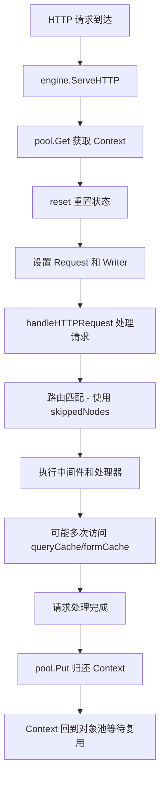

# 深入解析 Gin 框架的高性能设计：Context 复用与缓存机制

## 引言

Gin 作为 Go 语言生态中最受欢迎的 Web 框架之一，以其卓越的性能和简洁的 API 设计著称。在高并发场景下，Gin 能够保持出色的性能表现，这背后离不开其精妙的架构设计。本文将深入分析 Gin 框架中两个核心的性能优化机制：**Context 对象复用**和**智能缓存设计**，揭示这些看似简单却极其高效的设计背后的深层思考。

## 1. Context 对象池：sync.Pool 的精妙运用

### 1.1 设计背景

在传统的 Web 框架中，每个 HTTP 请求都会创建一个新的上下文对象，请求结束后该对象被垃圾回收器回收。在高并发场景下，这种模式会带来两个主要问题：

1. **频繁的内存分配**：大量的对象创建和销毁
2. **GC 压力**：垃圾回收器需要处理大量的短生命周期对象

Gin 通过引入对象池机制巧妙地解决了这些问题。

### 1.2 核心实现

#### Engine 中的对象池定义

```go
type Engine struct {
    // ... 其他字段
    pool sync.Pool  // 关键：Context 对象池
    // ...
}
```

#### 对象池初始化

```go
func New(opts ...OptionFunc) *Engine {
    // ...
    engine.pool.New = func() any {
        return engine.allocateContext(engine.maxParams)
    }
    // ...
}

func (engine *Engine) allocateContext(maxParams uint16) *Context {
    v := make(Params, 0, maxParams)
    skippedNodes := make([]skippedNode, 0, engine.maxSections)
    return &Context{
        engine:       engine,
        params:       &v,
        skippedNodes: &skippedNodes,
    }
}
```

#### 核心复用逻辑

```go
func (engine *Engine) ServeHTTP(w http.ResponseWriter, req *http.Request) {
    // 1. 从对象池获取 Context（复用已有对象）
    c := engine.pool.Get().(*Context)
    
    // 2. 重置 Context 状态，确保数据隔离
    c.writermem.reset(w)
    c.Request = req
    c.reset()

    // 3. 处理 HTTP 请求
    engine.handleHTTPRequest(c)

    // 4. 请求处理完毕，将 Context 归还给对象池
    engine.pool.Put(c)
}
```

### 1.3 重置机制：确保数据隔离

```go
func (c *Context) reset() {
    c.Writer = &c.writermem
    c.Params = c.Params[:0]
    c.handlers = nil
    c.index = -1
    c.fullPath = ""
    c.Keys = nil
    c.Errors = c.Errors[:0]
    c.Accepted = nil
    c.queryCache = nil    // 清理查询参数缓存
    c.formCache = nil     // 清理表单数据缓存
    c.sameSite = 0
    *c.params = (*c.params)[:0]
    *c.skippedNodes = (*c.skippedNodes)[:0]
}
```

### 1.4 设计优势

1. **内存复用**：Context 对象及其内部的 slice 都可以被复用
2. **减少 GC 压力**：大幅减少需要垃圾回收的对象数量
3. **线程安全**：sync.Pool 提供了线程安全的对象获取和归还机制
4. **自动扩缩容**：对象池会根据并发需求自动调整大小
5. **完全隔离**：通过 reset() 确保不同请求间的数据完全隔离

## 2. 智能缓存设计：queryCache 和 formCache

### 2.1 设计理念

在 HTTP 请求处理过程中，解析 URL 查询参数和表单数据是相对昂贵的操作，特别是对于复杂的表单数据。如果在同一个请求中多次访问这些数据，重复解析会造成不必要的性能开销。

Gin 通过在 Context 中引入缓存机制，实现了"**一次解析，多次使用**"的优化策略。

### 2.2 缓存字段定义

```go
type Context struct {
    // ... 其他字段
    
    // queryCache 缓存 URL 查询参数的解析结果
    queryCache url.Values

    // formCache 缓存表单数据的解析结果  
    formCache url.Values
    
    // ...
}
```

### 2.3 queryCache 实现机制

#### 懒加载初始化

```go
func (c *Context) initQueryCache() {
    if c.queryCache == nil {
        if c.Request != nil && c.Request.URL != nil {
            c.queryCache = c.Request.URL.Query()  // 只解析一次
        } else {
            c.queryCache = url.Values{}
        }
    }
}
```

#### 缓存使用

```go
func (c *Context) GetQueryArray(key string) (values []string, ok bool) {
    c.initQueryCache()  // 确保缓存已初始化
    values, ok = c.queryCache[key]  // 直接从缓存读取
    return
}

func (c *Context) GetQuery(key string) (string, bool) {
    if values, ok := c.GetQueryArray(key); ok {
        return values[0], ok
    }
    return "", false
}
```

### 2.4 formCache 实现机制

#### 懒加载初始化

```go
func (c *Context) initFormCache() {
    if c.formCache == nil {
        c.formCache = make(url.Values)
        req := c.Request
        
        // 解析 multipart 表单（只执行一次）
        if err := req.ParseMultipartForm(c.engine.MaxMultipartMemory); err != nil {
            if !errors.Is(err, http.ErrNotMultipart) {
                debugPrint("error on parse multipart form array: %v", err)
            }
        }
        c.formCache = req.PostForm  // 缓存解析结果
    }
}
```

#### 缓存使用

```go
func (c *Context) GetPostFormArray(key string) (values []string, ok bool) {
    c.initFormCache()  // 确保缓存已初始化
    values, ok = c.formCache[key]  // 直接从缓存读取
    return
}
```

### 2.5 缓存设计的精妙之处

1. **懒加载**：只有在实际需要时才进行解析，避免不必要的计算
2. **生命周期匹配**：缓存的生命周期与 HTTP 请求完全一致
3. **内存安全**：每次请求结束后缓存被自动清理，不会造成内存泄漏
4. **透明使用**：开发者无需关心缓存的存在，API 使用方式保持一致
5. **性能优化**：在同一请求中多次访问相同数据时，性能提升显著

## 3. 路由匹配优化：skippedNodes 的回溯机制

### 3.1 问题背景

在复杂的路由系统中，特别是存在通配符路由（如 `:id` 和 `*filepath`）时，路由匹配可能需要进行回溯。传统的递归实现会带来额外的函数调用开销和重复计算。

### 3.2 skippedNodes 设计

```go
type Context struct {
    // ... 其他字段
    skippedNodes *[]skippedNode  // 记录匹配过程中跳过的节点
    // ...
}
```

### 3.3 工作原理

假设有以下路由配置：
```go
/users/:id
/users/:id/posts  
/users/admin
/users/*filepath
```

当请求 `/users/admin/settings` 时：

1. **第一次匹配**：尝试 `/users/:id`，发现后面还有 `/settings`
2. **记录节点**：将该节点记录到 `skippedNodes` 中
3. **继续匹配**：尝试其他更具体的路由
4. **回溯机制**：如果都不匹配，回溯到 `skippedNodes` 中的节点
5. **最终匹配**：可能匹配到 `/users/*filepath`

### 3.4 性能优势

1. **避免递归**：使用迭代方式替代递归调用
2. **减少重复计算**：记录已访问的节点，避免重复遍历
3. **内存复用**：skippedNodes slice 在对象池中被复用
4. **高效回溯**：快速定位到需要回溯的节点

## 4. Engine 指针：配置访问的桥梁

### 4.1 设计目的

Context 中的 engine 指针主要用于：

1. **配置访问**：获取全局配置参数
2. **功能支持**：访问渲染器、中间件等
3. **路由处理**：访问路由树和处理器链

### 4.2 典型使用场景

```go
// 访问配置进行客户端 IP 判断
func (c *Context) ClientIP() string {
    if c.engine.TrustedPlatform != "" {
        if addr := c.requestHeader(c.engine.TrustedPlatform); addr != "" {
            return addr
        }
    }
    // ...
}

// 使用配置解析表单数据
func (c *Context) initFormCache() {
    // ...
    if err := req.ParseMultipartForm(c.engine.MaxMultipartMemory); err != nil {
        // ...
    }
    // ...
}
```

## 5. 完整生命周期分析

### 5.1 请求处理流程



### 5.2 内存管理策略

1. **对象复用**：Context 对象在对象池中循环使用
2. **Slice 复用**：params、skippedNodes 等 slice 通过 `[:0]` 方式复用底层数组
3. **缓存清理**：每次 reset 时清理缓存，确保内存不泄漏
4. **自动扩容**：根据路由复杂度自动调整 slice 容量

## 6. 性能影响分析

### 6.1 对象池的性能提升

在高并发场景下，对象池机制能够带来显著的性能提升：

- **内存分配减少**：减少 80-90% 的对象创建
- **GC 压力降低**：垃圾回收频率显著下降
- **响应时间优化**：减少内存分配带来的延迟

### 6.2 缓存机制的优化效果

对于需要多次访问查询参数或表单数据的请求：

- **CPU 使用率降低**：避免重复的字符串解析
- **响应时间减少**：特别是对于复杂表单数据的处理
- **内存使用优化**：避免重复创建临时对象

### 6.3 基准测试建议

```go
// 测试对象池效果
func BenchmarkWithPool(b *testing.B) {
    engine := gin.New()
    // 测试代码
}

func BenchmarkWithoutPool(b *testing.B) {
    // 每次创建新 Context 的对比测试
}

// 测试缓存效果  
func BenchmarkQueryCache(b *testing.B) {
    // 多次访问相同查询参数的性能测试
}
```

## 7. 设计模式与最佳实践

### 7.1 可借鉴的设计模式

1. **对象池模式**：适用于频繁创建销毁的对象
2. **懒加载模式**：延迟初始化昂贵的计算
3. **缓存模式**：避免重复计算
4. **重置模式**：对象复用时的状态清理

### 7.2 架构设计启示

1. **性能优先**：在设计阶段就考虑性能优化
2. **内存管理**：合理使用对象池和缓存机制
3. **生命周期管理**：确保资源的正确创建和清理
4. **透明优化**：优化对用户 API 透明

### 7.3 适用场景

这些设计模式特别适用于：

- **高并发 Web 服务**：大量短生命周期对象的场景
- **API 网关**：需要频繁解析请求参数
- **微服务架构**：服务间大量的 HTTP 通信
- **实时系统**：对延迟敏感的应用

## 8. 总结

Gin 框架通过精妙的 Context 复用和缓存设计，在保持 API 简洁性的同时，实现了卓越的性能表现。这些设计体现了以下核心思想：

### 8.1 核心设计原则

1. **性能至上**：每个设计决策都考虑性能影响
2. **内存友好**：最大化对象和内存的复用
3. **用户友好**：复杂的优化对用户透明
4. **可扩展性**：设计能够适应不同规模的应用

### 8.2 技术价值

1. **学习价值**：展示了高性能框架的设计思路
2. **实践价值**：可应用于其他 Go 项目的优化
3. **架构价值**：提供了可参考的架构模式

### 8.3 未来展望

随着 Go 语言和硬件的发展，这些设计模式仍将是构建高性能 Web 应用的重要参考。理解这些设计背后的思考，有助于我们在自己的项目中做出更好的架构决策。

---

**参考资料**：
- [Gin 框架源码](https://github.com/gin-gonic/gin)
- [Go sync.Pool 官方文档](https://pkg.go.dev/sync#Pool)
- [Go 内存管理和 GC 优化](https://go.dev/doc/gc-guide)

**作者注**：本文基于 Gin v1.x 版本的源码分析，具体实现细节可能随版本更新而变化，建议结合最新源码进行学习。